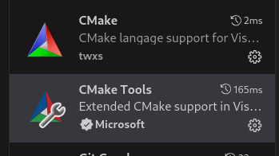
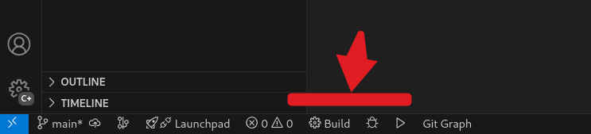

# Hello World amb CMake

## CMake

(cross-platform make) és una eina de desenvolupament de programari gratuïta i multiplataforma per crear aplicacions mitjançant instruccions independents del compilador. També pot automatitzar proves, embalatge i instal·lació.

La clau de CMake és que no intenta ser un sistema de construcció sinó que simplement fa servir algun sistema existent. (Make, Visual Studio, Ninja, Qt, ...). També es pot fer servir per compilar, executar proves unitàries (CTest) i generar paquets (CPack)

No li diem *"Compila el fitxer main.cpp"* sinó que el que fem és dir-li *"agafa aquesta llista de codi i genera un executable"* i el que fa és generar les instruccions sobre com es construeix l'executable, no intenta construir-lo ell mateix.

El fet que generi instruccions de compilació li no ser una eina de compilació com Make, Ninja o MSBuild sinó que proporciona un llenguatge que serà transformat a les instruccions del sistema de construcció que trobi on el fem servir (Unix Make,  Ninja, CodeBlocks, Eclipse CDT,  KDevelop, Sublime Text 2,  Borland Make, MSYS Make, MinGW Make,  NMake, NMake JOM, Watcom WMake, Kate, CodeLite, Xcode, Visual Studio, ...)

## Funcionament

Es genera un fitxer amb les instruccions en l'arrel del projecte que s'ha de dir `CMakeLists.txt`. 

L'exemple més bàsic té tres línies:

- Versions de CMake que es poden fer servir
- Nom del projecte (s'hi poden definir la versió i el llenguatge)
- Generació de l'executable

```cmake
cmake_minimum_required(VERSION 3.10...4.0)
project(hello)
add_executable(hello src/main.cpp)
```

En l'exemple que hi ha en el repositori defineix que la versió de C++ a fer servir ha de ser de la versió 17.

### Generar un executable

Per generar un executable el primer es generar les instruccions de compilació (es recomana fer-ho en una carpeta exclosa de GIT per no emplenar de codi innecessari el repositori). És habitual que la carpeta es digui **build**

```bash
mkdir buid
cd build
cmake ..
```

> En el pas de generar el codi per compilar el programa es pot forçar el generador amb el paràmetre `-G` ( -G "Unix Makefiles", -G Ninja, etc..). Si no es proporciona, CMake en busca un en el sistema de forma automàtica.

Després per compilar només cal executar el programa que es fa servir `make` ... o bé fer-ho a traǘes de CMake:

```bash
cmake --build .
```

## IDES

La major part dels grans IDEs de C o C++ suporten CMake nadiuament o a través de components: Visual Studio, CLion, Eclipse, NeoVim, VSCode, ...

### VSCode

En VSCode s'instal·len els components CMake (per la sintaxi del fitxer CMakeLists.txt) i CMake-Tools (per compilar i debuggar automàticament)



Després s'ha d'executar el programa amb els botons que surten a la barra inferior del IDE.



Per defecte l'executable sortirà en la carpeta `build`


